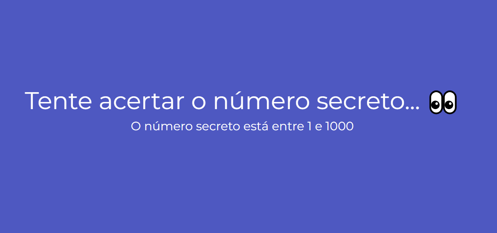
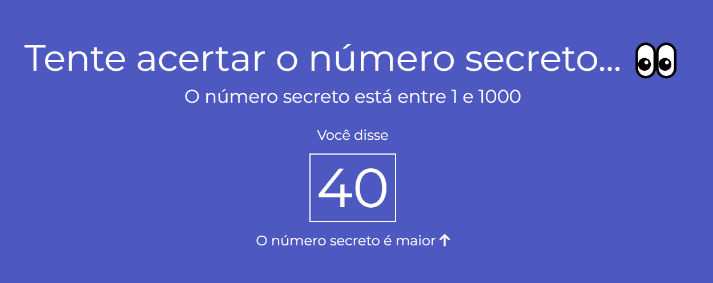
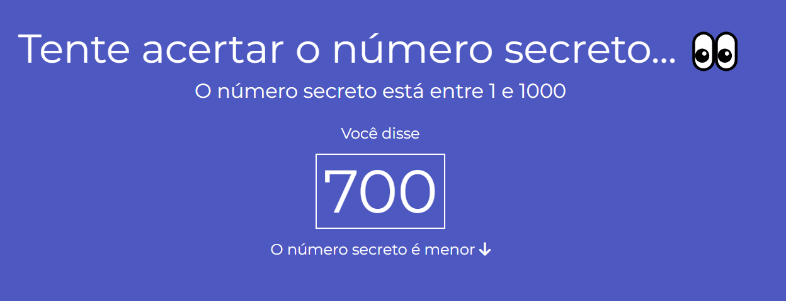
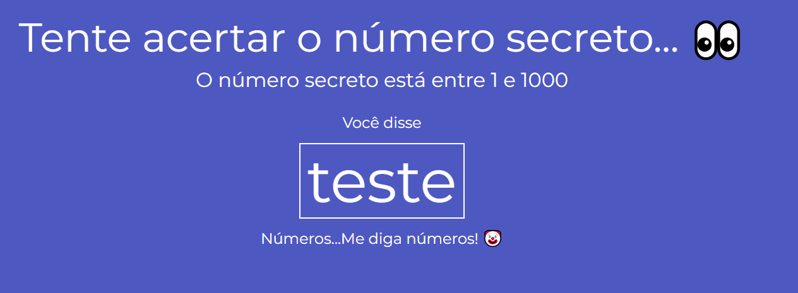
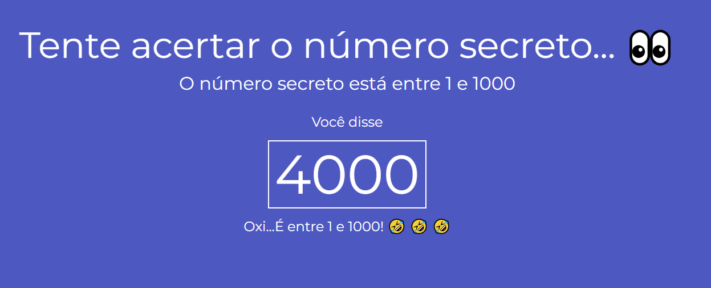
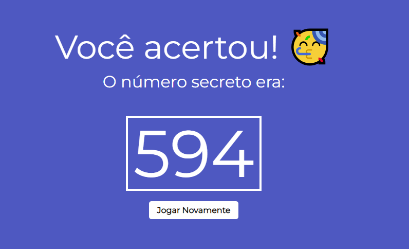

# Alura - Jogo Adivinha

Alura game project with voice recognition API

## Content

* [Overview](#overview) 
     * [The Challenge](#the-challenge)
* [My Process](#my-process)
     * [Technologies](#technologies)
     * [What I learned](#what-i-learned)
     * [Final Project](#final-project)
* [Author](#author)

## Overview

Another great experience working on this project, it was fun from the beggining to final commits. Personally I've never heard about an API that collects information through voice and storage it in a variable, furthermore being capable of changing its type (so cool). I've spent a week working on this project...it is simples, but it was made with a smile in every line of code :smile: !

### The Challenge

The challenge was to make a web app using an API that collects information through voice.

## My Process

The project was divided in five parts:
- Starting with HTML structure, it is simple...but it got some dynamic changes through JavaScript files;
    - I used [Awesome Fonts](https://fontawesome.com/search?q=up%20arrow&o=r) to get up and down arrows;
    - I also used [cdnjs](https://cdnjs.com/libraries/meyer-reset) librarie to reset my CSS standarts configs;

- The CSS was as simples as HTML structure, used variables and google fonts;

- The JavaSctipt...It was necessary to divide it in three parts.
    - voice.js - This document is resposible to call the [Web Speech API](https://developer.mozilla.org/en-US/docs/Web/API/Web_Speech_API/Using_the_Web_Speech_API) and through voice recongnition storage its value in a variable. The function `onSpeak(e)` has the responsability to change the screen content as the user keeps guessing;
    - random.js - This one is responsible to generate a hidden random number, if the user got it right, it wins!
    - validation.js - Right here is where the magic happens...the function `verify(guess)` filters each value when the API collect it. It got some `if else` and `switch case` that helps a lot!

### Technologies

- [HTML5](https://www.w3schools.com/)
- [CSS3](https://www.w3schools.com/css/default.asp)
    - [CSS3 Variables](https://www.w3schools.com/css/css3_variables.asp)
- [JavaScript](https://www.w3schools.com/js/default.asp)
    - [Elements DOM](https://www.w3schools.com/js/js_htmldom_html.asp)
    - [Web Speech API](https://developer.mozilla.org/en-US/docs/Web/API/Web_Speech_API/Using_the_Web_Speech_API)

### What I learned

The feeling of "one more step" closer to achieve my dream of working as a Dev. As simples as it looks, I see the beauty of making projects like this... It just reminds me the "what I'm fighting for"...

### Final Project

Initial Screen:

When the number is a lower value:

When the number is a highest value:

When the user says anything besides a number:

When the user says a number that goes over the limit:

When the user guess right:

## Author

- LinkedIn - [Vinicius Duarte](https://www.linkedin.com/analytics/post-summary/urn:li:activity:7143273780763688960/)
- Intagram - [@vinicius_duartesd](https://www.instagram.com/vinicius_duartesd/)